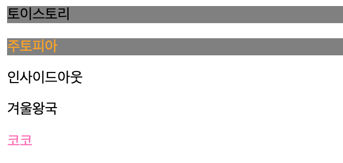
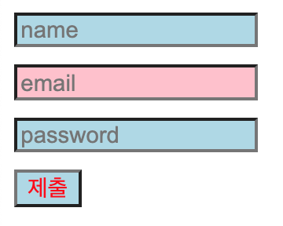

# 📌 11일차 
- 2021.09.07(화)
- 목차 : 선택자

<br>

## ✅ 선택자 (selector)
- html 요소를 선택할 때 사용
- JavaScript에서도 선택자를 사용해 html요소를 선택한다

<br>


### 👉 주요 선택자 
```CSS
h1 { color : red; }
```
- **타입 선택자(type selector)** : 태그 이름을 통해 요소를 선택하는 선택자 
- 하나의 html문서 내부의 특정 요소 모두에 스타일을 적용된다
- 특정 요소에 일관적으로 적용해야하는 공통 스타일을 위해 많이 사용하고, CSS파일 상단에 작성하는 편이다

<br>

```html
<ul>
    <li id="title">아이디는 하나의 웹 문서에 중복될 수 없다</li>
    <li class="blue green">GREEN</li>
    <li class="blue">BLUE</li>
</ul>
```
```CSS
/* ID selector */
li#title { color:orange; }

/* class selector */
li.blue { color:blue; }
li.green { color:green; }
```


- 태그의 id와 class를 사용해 특정 요소를 선택한다
- id는 `#` 을 사용해 선택하고, clss는 `.`를 사용한다
- class는 하나의 요소에 여러개를 지정할 수 있고, 캐스캐이딩 원칙에 의해 나중에 작성된 스타일이 적용된다

<br>


### 👉 속성 선택자 (Attribute Selector)
- html태그가 갖는 속성값을 사용해 요소를 선택할 때 사용한다

```html
<p><a href="sample1" target="_blank">SAMPLE01</a></p>
<p><a href="sample2.html" target="_blank">SAMPLE02</a></p>
<p><a href="test_sample3.html">SAMPLE03</a></p>
<p><a href="sample1">SAMPLE04</a></p>
```
```CSS
/* 속성 선택자 (Attribute Selector) */
a[target] { color:hotpink; }
a[target="sample1"] { color:green; }
a[target^="test"] { color:orange; }
a[target$=".html"] { background-color:gray; }
a[target*="html"] { font-style:italic; }
```


- `[attr]` : html태그에 해당 속성이 있으면 선택
- `[attr=""]` : html태그의 속성값까지 동일하면 선택
- `[attr^="⭐"]` : 속성의 값이 ⭐으로 시작하는 속성값을 찾아서 선택 
- `[attr$="⭐"]` : 속성의 값이 ⭐으로 끝나는 속성값을 찾아서 선택 
- `[attr*="⭐"]` : 속성의 값이 ⭐을 포한하는 경우를 찾아서 선택

<br>


### 👉 가상클래스 선택자 (Pseudo-Class Selector)
- 기존의 선택자들에 가상 클래스 선택자를 추가해서 선택하기 원하는 요소의 범위를 좁힐 수 있다
- 가상 클래스 선택자는 class 선택자와 함께 사용할 수 있다
    - class 선택자와 함께 사용할 때, 동일한 class를 가진 요소 중 n번째 요소를 선택하는 것이 아니라
    - class 선택자로 선택한 요소의 **형제 요소 중 n번째 요소를 의미하는 것이므로 주의하자**


-------------

```html
<ul>
    <li class="fruit apple">사과</li>
    <li class="fruit banana">바나나</li>
</ul>
<ol>
    <li class="moive insideout">인사이드아웃</li>
    <li class="moive toystory">토이스토리</li>
</ol>
```
```css
li:first-child { color:hotpink; }
li.movie:first-child { font-size:20px; }
```


1. `:first-child` : 선택한 태그의 형제 요소 중 첫번째 요소를 선택한다
2. `:last-child` : 선택한 태그의 형제 요소 중 마지막 요소를 선택한다
3. `:nth-child(n)` : 선택한 태그의 형제 요소 중 n번째 요소를 선택한다
4. `:nth-child(2n+1)` : 선택한 태그의 형제 요소 중 2n+1번째 요소를 선택한다.
   - 이 때, 2n+1이라는 수식 외에도 다양한 수식을 사용할 수 있다 (예) n+3
5. `:nth-child(even)` : 선택한 태그의 형제 요소 중 짝수번째 요소를 선택한다
6. `:nth-child(odd)` : 선택한 태그의 형제 요소 중 홀수번째 요소를 선택한다

<br>

-------------

```html
<section>
    <div class="movie">토이스토리</div>
    <p class="movie">주토피아</p>
    <p class="movie">인사이드아웃</p>
    <p class="movie">겨울왕국</p>
    <div class="movie">코코</div>
</section>
```
```css
p:first-of-type { color : orange; }
div:last-of-type { color : hotpink; }
.movie:first-of-type { background-color : gray; }
```





7. `:first-of-type` : 선택한 태그 요소 중 첫번째 요소를 선택한다  
    - `.movie:first-of-type` : class선택자와 함께 사용하면 위의 예제에서는 토이스토리와 주토피아에 스타일이 적용된다
    - 어떠한 태그인지 명시하지 않고 class선택자를 사용해 요소를 선택했기 때문
8. `:last-of-type` : 선택한 태그 요소 중 마지막 요소를 선택한다
9. `:nth-of-type(n)` : 선택한 태그 요소 중 n번째 요소를 선택한다
10. `:nth-of-type(even)` : 선택한 태그 요소 중 짝수번째 요소를 선택한다
11. `:nth-of-type(odd)` : 선택한 태그 요소 중 홀수번째 요소를 선택한다

<br>

-------------
```html
<form>
    <input type="text" placeholder="name">
    <input type="email" placeholder="email">
    <input type="password" placeholder="password" class="pw">
    <input type="submit">
</form>
``` 
```css
input:not(.pw) { background-color:pink; }
input:not([type=email]) { background-color:lightblue; }
input:not([placeholder]) { color:red; }
```




12. `A:not(B)` : A 태그 중 B가 아닌 요소를 선택한다

<br>

-------------
```html
<a href="sample1.html">Sample Link</a>
<a href="sample2.html">Visited Link</a>
```
```css
a:link{ color : tomato; } 
a:visited{ color : yellowGreen; } 
```


> 동적 가상 클래스 : 사용자의 동작으로 인해 바뀌는 상태에 따른 선택자
13. `a:link` : 동적 가상 클래스 선택자 / 연결된 웹에 방문한 적이 없는 경우 
14. `a:visited` : 동적 가상 클래스  / 연결된 웹에 방문한 적이 있는 경우  


<br>

-------------
```html
<input type="button" value="클릭하세요">
<input type="button" value="클릭하세요">
<input type="button" value="클릭하세요">
```
```css
input[type=button]:hover { background-color:skyblue; }
input[type=button]:active { background-color:teal; }
input[type=button]:focus { background-color:teal; }
```

> 동적 가상 클래스 : 사용자의 동작으로 인해 바뀌는 상태에 따른 선택자
15. `:hover` : 사용자가 요소 위에 마우스를 올렸을 때, 스타일을 적용시키기 위한 선택자 
16. `:active` : 사용자가 마우스를 누른 시점부터 떼는 순간까지, 스타일을 적용시키기 위한 선택자
17. `:focus` : `tab`키를 사용했을 때 포커싱 되는 순간, 스타일을 적용시키기 위한 선택자
- 동적 가상 클래스를 사용할 때에는 우선순위에 주의하자
    - LVHA 순서 : `:link` → `:visited` → `:hover` → `:active`
    - `:active` 선택자를 다른 동적 가상 클래스보다 뒤에 배치도록 한다
    - **[참고]** https://developer.mozilla.org/ko/docs/Web/CSS/:active
    


<br>

-------------
```html
<div>
    <input type="text" placeholder="1"><
    <input type="text" placeholder="2">
    <input type="text" placeholder="3" disabled>
</div>
<div>
    <input type="checkbox" id="checkMe1" name="check1">
    <label for="checkMe1">CHECK ME!</label>
    <input type="checkbox" id="checkMe2" name="check2">
    <label for="checkMe2">CHECK ME!</label>
</div>
```
```css
input[type=text]:disabled { background-color:tomato; }
input[type=text]:enabled { background-color:skyblue; }
input[type=checkbox]:checked { outline:3px solid lightgreen; }
```


> 동적 가상 클래스 : 사용자의 동작으로 인해 바뀌는 상태에 따른 선택자
18. `:enabled` : 활성화되어 있는 요소를 선택한다 
19. `:disabled` : disabled 속성을 가지고, 비활성화되어 있는 요소를 선택한다 
20. `:checked` : 


<br>