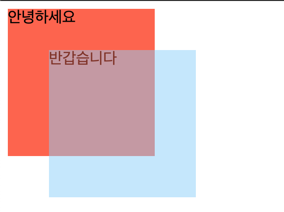
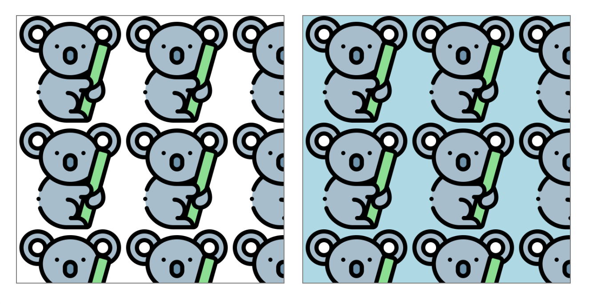

# 📌 13일차 
- 2021.09.09(목)
- 목차 : 색상과 배경

<br>

## ✅ 색상과 배경
### 👉 색상 : HEX(16진수) , RGB , RGBA
- 키워드 : red, blue 와 같이 색상명을 직접 입력해 사용할 수 있다. `transparent`는 투명을 의미한다 
- 키워드 외에도 RGB, HEX, RGBA 방식으로 색상을 지정할 수 있다
- RGB 3차원 좌표계를 사용해 색상을 표현하기도 한다 
    - `HEX` : `#` + 16진수 표기법 
        - (예) #10823a : 10은 red, 82은 green, 3a는 blue를 의미한다 
        - 0~F 의 순으로 채도를 의미한다. 0이 채도가 가장 낮고, F가 가장 높다
    - `RGB` : rgb(0, 0, 0)
        - 첫번째 숫자는 red, 두번째 숫자는 green, 마지막 숫자는 blue를 의미한다 
        - 255~0 의 순으로 채도를 의미한다. 255이 채도가 가장 낮고, 0가 가장 높다
    - `RGBA` : rgba(0, 0, 0, 0)
        - rgb()와 동일하지만, 마지막 숫자는 투명도(alpha)를 의미한다
        - 투명도(alpha)는 1~0의 범위를 가진다 
        - 0일 때는 완전히 투명해져 `transparent`와 같은 상태가 된다

<br>


### 👉 `opacity`
```html
<div>안녕하세요</div>
<div class="floating-box">반갑습니다</div>
```
```css
div{ width:150px; height:150px; background-color:tomato;}
.floating-box {
    background-color:lightskyblue;
    position:fixed;
    left:50px; top:50px;
    opacity:0.5;
}
```



- 요소의 불투명도를 설정하고, 초기값은 1이다
- 요소의 불투명도를 설정하고, 초기값은 1이다
- 불투명도는 1.0 ~ 0.0 의 범위를 가진다. 소수점 앞의 숫자는 생략 가능하다 (예) 0.5 = .5 
- `opacity`를 조절하면, 요소의 내부 컨텐츠까지도 불투명도가 적용된다 
- `background-color`를 `rgba()`를 사용해 불투명도를 조절하면, <br> 이 때는 배경 색상에만 투명도가 적용되므로, 컨텐츠에는 영향을 주지 않는다


<br>


### 👉 `background-color`, `background-image`
```html
<div class="box1"></div>
<div class="box2"></div>
```
```css
    div{
        width: 300px; height:300px; 
        margin:10px; float:left; 
        border:1px solid gray;
        
        background-image: url(https://cdn-icons-png.flaticon.com/512/3069/3069172.png);
    }
    .box2{background-color:lightblue;}
```



- `background-color` : 배경의 색상을 결정한다 
- `background-image` : 배경의 이미지를 정의한다
- 두 속성을 모두 사용할 때에는, `background-color`가 `background-image`의 뒤에 렌더링된다
- `background-image`가 투명한 부분을 가지고 있는 경우, 투명한 부분에 `background-color`가 보여지게 된다 
- 웹 접근성⭐️
    - 웹 브라우저는 배경 이미지에대해 웹 접근성을 위한 추가 정보를 제공하지 않는다
    - 스크린 리더는 배경 이미지의 존재 유무조차 알 수 없다
    - 이미지가 웹 페이지에 대한 이해에 필수적인 정보를 가진다면, 문서 내부에서 구조적으로 설명하는 것을 권장한다 

<br>


### 👉 `background-repeat`
```html
<div class="box1"></div>
<div class="box2"></div>
<div class="box3"></div>
<div class="box4"></div>
```
```css
    div{ 
        width:240px; height:200px; margin-right:20px; float:left;
        background-image: url(https://cdn-icons-png.flaticon.com/512/3069/3069172.png);
    }
    .box1{ background-color:lightblue;  background-repeat: repeat ;} /* default */
    .box2{ background-color:lightgreen; background-repeat: repeat-x ;}
    .box3{ background-color:lightpink;  background-repeat: repeat-y ;}
    .box4{ background-color:lightcoral; background-repeat: no-repeat ;}
```


- 배경 이미지의 반복과 관련된 속성
- `repeat` : x축 방향과 y축 방향으로 배경 이미지를 반복한다 
- `repeat-x` : x축 방향으로 배경 이미지를 반복한다 
- `repeat-y` : y축 방향으로 배경 이미지를 반복한다
- `no-repeat` : 배경 이미지를 반복하지 않는다

<br>


### 👉 `background-position`
- 배경 이미지의 위치를 지정할 때 사용한다
- 초기값 : `background-position : 0 0`
- x축 위치와 y축 위치를 공백으로 구분지어 입력한다. 입력 순서는 상관없다
- `px`단위를 사용한 숫자값 외에도, 키워드를 사용할 수 있다
- 키워드 : `left` `right` `top` `bottom`
- 반드시 x축 위치와 y축 위치르 모두 입력하지 않아도 된다. 값을 하나만 사용할 수 있다


<br>


### 👉 `background-origin`


- 배경의 원점을 `border-box`, `content-box`, `padding-box` 내부 중 하나로 지정할 수 있다
- 초기값 : `background-origin : padding-box`

<br>

### 👉 `background-size`


- 배경 이미지의 크기를 지정한다.
- 초기값 : `background-size : auto` → 이미지의 원래 size를 적용한다


<br>

### 👉 `background` 단축 속성(short hand)


<br>


