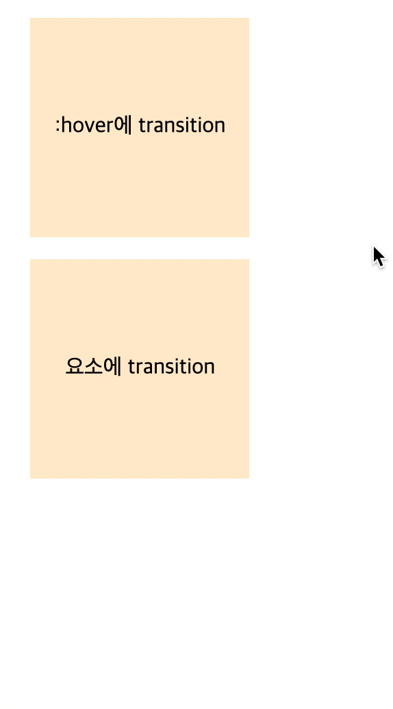

# 📌 14일차 
- 2021.09.10(금)
- 목차 : transition

<br>

## ✅ 트렌지션
### 👉 `transition`
- 요소의 현재 스타일에 변화를 줄 때 사용
- 이 때 변화하는데 시간차를 주어 변화하는 모습을 시각적으로 확인할 수 있게 한다


<br>


### 👉 `transition-property`
```css
.test1 { transition-property : width, height; }
.test2 { transition-property : color; }
.test3 { transition-property : all; }
.test4 { transition-property : none; }
```
- 요소의 현재 스타일 중 특정 속성에만 변화를 줄 때 사용
- 여러 스타일을 변화할 때에는 `,`를 구분자로 사용
- 모든 스타일을 변화할 때에는 `all`

<br>


### 👉 `transition-duration`
```css
/* color를 0.5초동안 변화 */
.test1 { 
    transition-property : color;
    transition-duration : 500ms;
}

/* width는 0.5초, height는 1초동안 변화 */
.test2 { 
    transition-property : width, height;
    transition-duration : 500ms, 1s;
}

/* width, height 2초동안 변화 */
.test2 { 
    transition-property : width, height;
    transition-duration : 2s;
}
```
- 요소의 스타일을 변화하는데 걸리는 시간을 지정
- `<time>` 자료형을 사용하고 단위는 `ms`나 `s`을 사용한다 (`1000ms`는 `1s`를 의미)
  
```css
/* 마우스가 요소에 올라갈 때에만 transition 적용 */
.test3 { width:200px; height:200px; background-color:lightyellow;}
.test3:hover { 
    width: 300px; height:300px; background-color:tomato;
    
    transition-property : all;
    transition-duration : 2s;
}
```

- `:hover`에 `transition`을 주게 되면, 마우스가 올라갈 때에는 적용되지만 내려올 때에는 적용되지 않는다

```css
/* 마우스가 요소에 올라가고 내려올 때 모두 transition 적용 */
.test4 { 
    width:200px; height:200px; background-color:lightyellow;
    
    transition-property : all;
    transition-duration : 2s;
}
.test4:hover { width: 300px; height:300px; background-color:forestgreen}
```
  
- 마우스가 올라가고 내려올 때 모두 `transition`을 주고자 한다면 요소의 스타일에 적용해야한다
- 아래 gif를 통해 차이점을 확인해보자



<br>


### 👉 `transition-delay`
```css
/* 1초 딜레이 후 모든 스타일이 2초동안 변화 */
.test1 {
    transition-property : all;
    transition-duration : 2s;
    
    transition-delay : 1s;
}
```
- `transition`이 실행되기 전에 지연시키기위한 속성
- `<time>` 자료형을 사용하고 단위는 `ms`나 `s`을 사용한다 (`1000ms`는 `1s`를 의미)

<br>


### 👉 `transition-timing-function`
- `transition`이 실행되는 중간 과정의 시간을 조절하기 위한 속성
- 예를 들어 `color`가 red → blue로 변화할 때, 보라색을 거치게 되는데 이러한 중간 과정에 소요되는 시간을 조절
- 초기값 : `transition-timing-function : ease; `
- 키워드 : `ease`, `ease-in`, `ease-out`, `ease-in-out`, `linear`, `step-start`, `step-end`

- [참고] https://developer.mozilla.org/en-US/docs/Web/CSS/transition-timing-function

<br>


### 👉 `transition` 단축 속성 (short hand)
- `transition`과 관련된 속성을 한번에 설정할 수 있는 단축 속성
- 초기값
    - `transition-delay : 0s` 
    - `transition-duration : 0s` 
    - `transition-property : all` 
    - `transition-fiming-function : ease` 
- 동일하게 `<time`> 자료형을 사용하는 속성이 있으므로, 작성 순서가 중요하다 
- 권장 작성 순서 : `property-name`, `duration`, `timing-function`, `delay`
<br>


### 👉 `transform` + `transition` 활용 예시
```css
.test1 {
    width:100px; height:100px;
    border:10px solid seagreen;
    background-color:lightblue;
    border-radius:30px;
    
    transition : all 2s ease-in-out;
    transform-origin:bottom right;
}
.test1:hover {
    transform : rotate(360deg);
}
```

<br>


