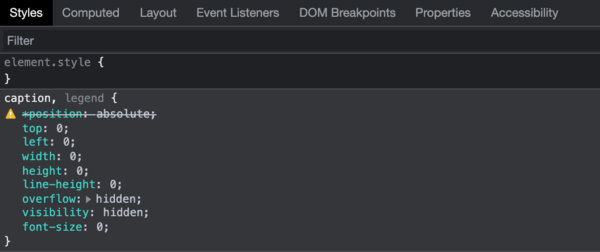
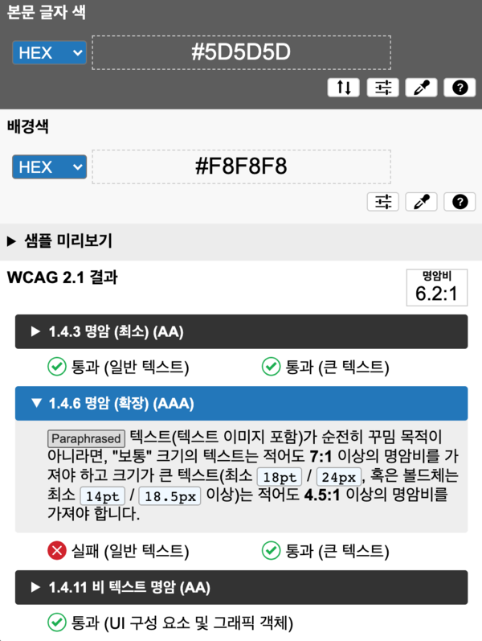

 

## 📌 [2단계] 미션2. HTML/CSS 개인과제

### 👉 접근성이 좋지 않은 테이블이 있는 웹페이지를 선정
테이블을 사용하는 웹 페이지를 먼저 찾아야 개중에 접근성이 좋지 않은 케이스를 선택할텐데. 테이블을 쓰는 웹 서비스를 어떻게 찾아야할지부터 막막했다. 
일단 요금 안내나 서비스 안내 페이지에는 테이블을 사용할 것이라고 생각해 검색을 시작했고, 몇 개의 후보를 선정할 수 있었다. 
그 중 비교적 웹 접근성이 좋지 않은 테이블을 사용한 지역별 택시 요금안내 페이지(http://www.taxi.or.kr/02/01.php) 를 선정했다.  

 

---
 

### 👉 웹 표준 준수 및 웹접근성 관점에서 기존 서비스의 문제점 분석
#### ✅ 테이블의 제목과 요약 정보

- 시각에 장애가 있는 사용자들은 스크린리더를 사용해 데이터 테이블의 내용을 귀로 듣기 때문에 테이블은 스크린리더가 이해하기 쉽게 구성해야한다. 
- **스크린 리더는 마크업을 참고해서 데이터 테이블을 읽어준다.** 그렇기 때문에 테이블의 내용과 구조가 중요하다.

- 데이터를 테이블로 구성할 경우 테이블의 내용, 구조 등을 이해할 수 있게 제목 셀과 내용 셀이 구분되도록 구성해야 한다. 
- **제목은 `<th>` 요소에, 내용은 `<td>` 에 담아야한다.** 
- 그리고 **테이블의 제목과 요약 정보도 제공**해야하는데, 제목과 요약 정보가 동일하지 않도록 주의해야한다. 
- 제목은 테이블의 첫번째 자식 요소로 작성해야하며, 만약 요약 정보를 제공하기 어려운 경우 제목 셀의 내용을 나열하여 사용한다. 
- DOCTYPE에 따라 제목과 요약정보 작성 방법에는 아래와 같은 차이가 있다.

> 1. XHTML과 HTML4
>     - 데이터 테이블의 제목은 `<caption>` 에 작성한다
>     - 요약 정보는 `<table>` 태그의 `summary` 속성에 작성한다 
> 2. HTML5
>     - HTML5에서는 `summary` 속성이 사라졌다
>     - `<caption>` 에 제목과 요약 정보를 모두 제공한다

 

DOCTYPE에 따라 제목과 요약정보 작성 방법에 차이가 있기 때문에 먼저 HTML 문서의 DOCTYPE을 확인해 보았다. DOCTYPE 을 확인해보면 XHTML을 사용하고 있음을 알 수 있다. 

 

XHTML의 경우 데이터 테이블의 제목은 `<caption>` 에, 요약 정보는 `<table>` 태그의 `summary` 속성에 작성해 주어야하는데 제목은 명시되어 있으나 요약 정보는 작성되어 있지 않았다. 
DOCTPYE을 웹 표준에 맞게 HTML5로 변경하여 제목과 요약 정보를 모두 `<caption>`에 작성하도록 하자

 

- `<caption>` 은 보이지않도록 처리해 주어야한다
- `display:none;`이나 `visibility:hidden;` 을 사용하면 스크린 리더에서 읽어주지 않게 된다. 
- 따라서 다른 방법으로 보이지 않게 처리해야 한다. 

CSS를 살펴보니 `visibility:hidden;` 를 사용해 숨김 처리 해주었으므로,  스크린 리더에서 읽어줄 수 있도록 다른 방법을 사용해 보이지 않도록 수정한다. 

 

그리고 제목 셀과 내용 셀이 `<th>`, `<td>` 태그로 명확히 구분되어 있음을 확인하였다.

 

#### ✅ colgroup

- 주로 데이터 테이블의 열 너비 지정을 위해 사용하며, `<caption>` 다음에 위치해야한다. 
- `<colgroup>` 태그의 자식 요소인 `<col>` 태그는 `<table>`에 속하는 각 열의 속성을 정의할 때 사용한다.

 

선정한 서비스에서는 `<colgroup>` 을 사용하지 않았는데, `<colgroup>`의 속성을 사용해 열의 너비를 지정해보도록 한다.

 

#### ✅ thead, tbody, tfoot

- 테이블에서는 `<thead>`, `<tbody>`, `<tfoot>` 이 시맨틱 태그의 역할을 한다. 
- `<thead>` 는 테이블에서 제목 셀을 하나의 그룹으로 묶을 때 사용한다. 
- 웹 표준에 따르면 `<thead>` 의 형제 요소로는 반드시 `<tbody>` 혹은 `<tfoot>` 가 와야한다. 
- `<tbody>` 는 테이블의 body 영역을 의미하고 `<tfoot>` 은 테이블의 footer를 의미한다. 
- `<thead>`, `<tbody>`, `<tfoot>` 를 모두 사용하는 경우 작성 순서
    - `<thead>` → `<tfoot>` → `<tbody>` 를 준수한다.
    - 스크린 리더로 테이블의 데이터를 읽어주는 경우 일반적으로 `<tbody>` 의 내용이 많아서 `<tfoot>` 에 도달하기까지 시간이 소요되기 때문.
    - 코드 작성 순서는 `<tfoot>`가 `<tbody>`보다 위쪽에 위치해도, 실제 테이블에서는 가장 하단 행에 자리한다.

`<thead>`, `<tfoot>` 는 필수로 작성하지 않아도 되지만 제목 셀과 내용 셀의 구분을 명확히 하기 위해 `<thead>` 를 사용해보겠다. 

 

#### ✅ scope

- 제목 셀이 가로와, 세로로 모두 있는 경우 `scope` 속성으로 행 제목(`row`)과 열제목(`col`)을 구분 가능하도록 해야 한다. 
- 특정 열 그룹을 위한 열 제목이거나, 특정 행 그룹을 위한 행 제목인 경우에는 `colgroup`과 `rowgroup`을 사용한다. 

선정 사례의 경우 `<thead>` 에는 열 제목을 의미하는 `scope = "col"`을 사용하였는데 행 제목으로 생각되는 부분에는 scope가 작성되어 있지 않았다. 그리고 특정 행 그룹을 위한 행 제목(`rowgroup`)도 필요한 것으로 보여진다.

 

#### ✅ 내용 셀과 관련있는 제목셀과의 연결

- 담을 내용이 많아 데이터 테이블이 복잡한 경우, `id` 와 `headers` 속성을 사용해 제목 셀과 내용 셀을 연결한다. 
- 제목 셀에 `id` 를 부여하고, 관련있는 제목 셀의 `id` 값을 내용 셀의 `headers`에 작성한다. 
- 만약 연관성이 있는 제목 셀이 여러가지라면 공백을 구분자로 사용해 명시한다. 
- 스크린 리더는 `headers` 에 나열된 순서대로 제목 셀을 연결지어 읽어주게 된다
- 복잡한 데이터 테이블의 경우는 `id` 와 `headers` 를 활용해 웹 접근성을 높일 수 있다.

선정한 웹 페이지의 테이블에서는 id와 headers를 사용하지 않았다. 
사실 복잡한 표의 기준이 무엇인지 잘 판단이 서지 않아서 선정한 사례에 반드시 필요한 부분인지 고민이 많았다. 
개인적으로는 데이터 테이블의 내용이 많은 것으로 판단되어 id와 headers를 사용하여 수정해보도록 하겠다.

 

#### ✅ 명도 대비

- 명도 대비가 낮은 경우 가독성이 떨어져서 내용을 인식하기 어렵다. 
- 노안, 저시력, 색약, 색맹 등의 사용자들도 불편함이 없도록 콘텐츠를 제공하기 위해 글자와 배경색 명도 대비에 주의할 필요가 있다. 
- 뿐만 아니라 비장애인들도 명도 대비가 높으면 더 쉽게 컨텐츠를 인식할 수 있다. 
- 명도 대비는 4.5:1 이상이어야하고, 확대가 가능한 브라우저는 3:1 이상을 준수하면 된다. 
- 명도 대비는 Colour Contrast Analyser (CCA) 를 사용해 확인할 수 있다.
- CCA를 사용해서 텍스트 크기에 대한 웹 접근성 내용도 확인할 수 있다.

CCA를 통해 명도 대비를 확인해본 결과 명암비는 6.2:1로 웹 접근성에 준하는 비율을 가졌다. 
명도 대비에 관한 WCAG 가이드라인은 최소 기준과 확장된 기준이 있는데, 확장 기준에도 맞도록 명암 대비를 더 명확하게 수정해보도록 하자. 
  

 

#### ✅ 기타

바로 위의 셀과 동일한 내용인 경우 〃 를 사용해 표현했다.   
스크린리더가 이 기호를 어떻게 인지하고 읽어줄지 의문이 들어서 바로 위의 셀과 동일한 내용으로 채워주기로 한다.

 

---
 

### 👉 해당 이슈를 WCAG 가이드라인에 맞춰 수정 계획 선정

> **1.3.2 Meaningful Sequence**    
> When the sequence in which content is presented affects its meaning, a correct reading sequence can be programmatically determined.

- 콘텐츠가 표시되는 순서가 의미에 영향을 미치는 경우, 올바른 읽기 순서는 프로그래밍 방식으로 결정되어야 한다.
- 스크린 리더가 테이블의 데이터 올바른 순서로 읽을 수 있도록 `id`, `headers` 를 사용한다

 

> **1.4.3 Contrast (Minimum)**  
> The visual presentation of text and images of text has a contrast ratio of at least 4.5:1...  
>
> **1.4.6 Contrast (Enhanced)**  
> The visual presentation of text and images of text has a contrast ratio of at least 7:1 ... 

- 텍스트와 텍스트 이미지의 시각적 표현을 위한 명도 대비는 최소한 4.5:1 이상이 되어야 한다.
- 확장 기준에 준수하려면 명도 대비를 7:1 이상이 되도록 한다

 
 
> **2.4.2 Page Titled**  
> Web pages have titles that describe topic or purpose.

- 웹 페이지는 주제나 목적을 설명할 수 있는 제목이 있어야한다
- `<meta>` 태그와 `<title>` 태그를 사용해 웹 페이지의 제목과 정보를 제공한다

 
 
> **3.1.3 Unusual Words**  
> A mechanism is available for identifying specific definitions of words or phrases used in an unusual or restricted way, including idioms and jargon.
- 관용어와 전문용어을 포함하여, 특수하거나 제한적으로 사용된 단어나 문구의 구체적인 정의를 인식할 수 있는 메커니즘을 제공해야 한다.
- 바로 위의 셀과 동일한 내용인 경우 〃 를 사용했는데, 이를 바로 위의 셀과 동일한 내용으로 채워주기로 한다.

 

[참고] WCAG 2.1 : https://www.w3.org/TR/WCAG21/  
[참고] WCAG 2.1 (한국웹접근성평가센터 번역) : http://www.kwacc.or.kr/WAI/wcag21/#sotd

 

---
 

### 👉 웹접근성 관련 체크리스트 작성

- [ ] `<meta>` 태그와 `<title>`태그 를 사용해 웹페이지의 제목과 정보를 명시
- [ ] DOCTYPE에 따른 테이블의 제목과 요약 정보 
    - [ ] HTML5 : 제목과 요약 정보를 모두 <caption>에 작성
- [ ] `<caption>` 의 위치 : 반드시 `<table>` 의 첫번째 자식 요소
- [ ] `<caption>` 숨김 처리 
    - [ ] `display:none`을 사용하지 않는다
    - [ ] `visibility:hidden`을 사용하지 않는다
- [ ] 제목 셀(`<th>`)과 내용 셀(`<td>`)의 명확한 구분 
- [ ] `<table>`의 시맨틱 태그 사용
    - [ ] `<tbody>` 사용 
    - [ ] `<thead>`, `<tbody>`, `<tfoot>`을 모두 사용했을 때 작성 순서 준수
- [ ] `scope`를 사용한 행 제목과 열 제목의 명시 
    - [ ] 전체 행 제목 `scope = "row"`
    - [ ] 전체 열 제목 `scope = "col"`
    - [ ] 특정 행 그룹 제목 `scope = "rowgroup"`
    - [ ] 특정 열 그룹 제목 `scope = "colgroup"`
- [ ] 내용 셀과 제목 셀의 연결 (`id`, `headers` 사용)
- [ ] 명도 대비
    - [ ] 최소 기준 4.5 : 1
    - [ ] 확장 기준 7 : 1 
- [ ] 특수 사용 단어의 정의를 인식할 수 있도록 수정

 

---
 

### 👉 HTML/CSS를 활용하여 구현(자바스크립트 선택사항)
- 선택한 웹 페이지의 테이블 중 중형 택시에 대한 데이터 테이블을 구현한다
- 테이블 외적인 요소는 간소화하고, 자바스크립트과 관련된 부분은 생략한다
- <a herf=“”>HTML 코드 확인하기</a>
- <a herf=“”>CSS 코드 확인하기</a>
- <a herf=“”>JavaScript 코드 확인하기</a>
- 구현된 화면은 https://dev-ku.github.io/zerobase-mission2-2/ 에서 확인할 수 있다

 

---
 

### 👉 문법 검사 결과 제출

- `<footer>` 태그를 사용하지 말라는 에러가 하나 발생했는데 원인을 정확히 모르겠어서 일단 그대로 두었다
- 마크업 문법 검사 : http://validator.kldp.org/

- CSS 문법 검사 : https://css-validator.kldp.org/

 

---
 

### 👉 라이트하우스에서 접근성 및 SEO 관련 분석 리포트 제출

 

---
 

### 👉 프로젝트 완료 후기(시행착오 및 성장기)
처음 미션을 받았을 때에는 솔직히 정말 막막했다. 
웹 접근성에 대해 깊은 지식이 없었고 웹 페이지 선정이나 서비스 문제점을 분석하기보기보다 웹 접근성 공부가 선행되어야겠다는 생각부터 들었다. 
그래서 관련 강의와 공식 문서를 통해 나름대로 블로그에 웹 접근성에 대한 공부를 병행하며 미션을 진행했다. 웹 접근성이 무엇인지는 알고있었지만 이렇게
항목 하나하나를 세심히 살펴가며 공부하고 적용한 경험도 처음이었고, 라이트하우스에서 접근성 및 SEO 관련 분석 리포트에서도 만점을 받은 경험도 처음이다.
웹 접근성에 대한 중요성을 다시한번 깨닫게 된 계기가 되었다. 실제로 스크린 리더로 재구성한 웹 페이지를 돌려보고 싶었지만 무료 서비스를 찾을 수 없었다.
스크린리더을 사용하기 위해서는 커다란 금액을 지급해야하고 그마저도 웹 접근성에 맞지 않는 웹 서비스에서는 사용할 수 없다니 많은 생각이 들었다.

웹 접근성을 나름 공부를 병행하며 미션을 수행했지만 알고 있는 항목을 모두 주먹구구식으로 밀어 넣은건 아닌가 하는 걱정도 든다.
하지만 미션을 수행하며 배운 점들이 많기 때문에 추후에 더 수정하고 고쳐나갈 수 있을 거라고 믿는다. 즐거운 경험이었다.

 

 

